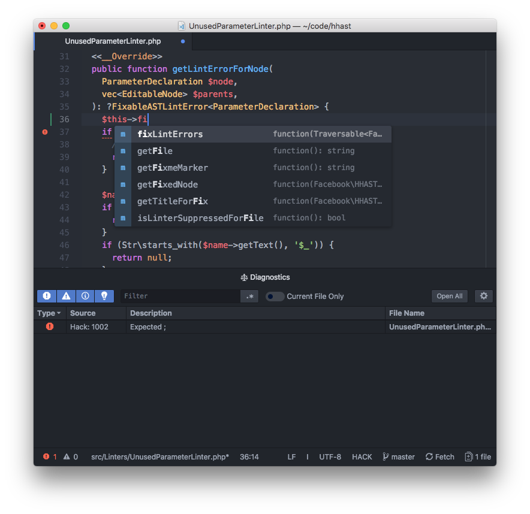

# atom-ide-hack

This plugin provides basic IDE support for Hack when using `atom-ide`; a
full-featured experience is available as part of [Nuclide](https://nuclide.io).

Atom-IDE and Nuclide are both currently unmaintained - we strongly recommend using Visual Studio Code and `vscode-hack` instead.

## Examples

## Requirements

* HHVM
* Atom
* The atom-ide-ui package

## Building `atom-ide-hack`

No build process is required; pure ES6 is used, which Atom natively understands

## Installing `atom-ide-hack`

Atom IDE
--------

Install the `ide-hack` and `atom-ide-ui` packages through the Atom UI, or run `apm install ide-hack atom-ide-ui`.

## Join the HackLang community

* Facebook page: https://www.facebook.com/groups/hhvm.general/
* irc: #hhvm on irc.freenode.net
* Twitter: https://twitter.com/hacklang

See the CONTRIBUTING file for how to help out.

## License
atom-ide-hack is MIT licensed, as found in the LICENSE file.
